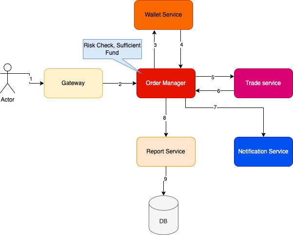
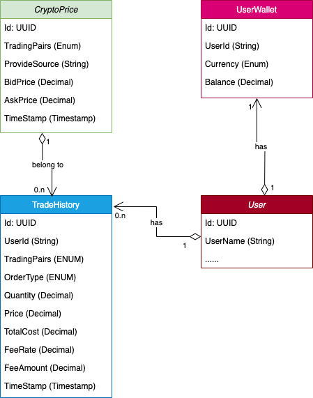

# Trade Service

### Description
1. Develop a crypto trading system with SpringBoot framework and in memory H2
Database.
2. Design the table structure based on the understanding of the questions.

### Functional
1. User able to buy/sell the supported crypto trading pairs
2. User able to see the list of trading transactions
3. User able to see the crypto currencies wallet balance

### Non-Functional
* Availability: no downtime
* Fault tolerance: fault tolerance and fast recovery
* Latency: round-trip should be in the millisecond
* Security: KYC (Know your client) check to verify user before new account opened, prevent DDos
* Performance: (It is enhancement feature)
  * use memory database like Redis (cluster) for handle millions of request for wallet service.
  * use Event Sourcing to build feature view transaction history in wallet  

### High Level Design

* In scope of this project we will: Design and implement trade service only. So in this service we need store user wallet information for funds check, sale/buy... 
* Other microservices will do in enhancement.

### Data Model

### API Design
1. Retrieve Latest Best Aggregated Price : 
   - GET /v1/trade/crypto-prices/latest
2. Trade Based on Latest Best Aggregated Price
   - POST /v1/trade
3. Retrieve Wallet Balance
   - GET /v1/trade/wallet/{userId}
4. Retrieve Trade History
   - GET /v1/trade/history/{userId}
### Running and Testing
